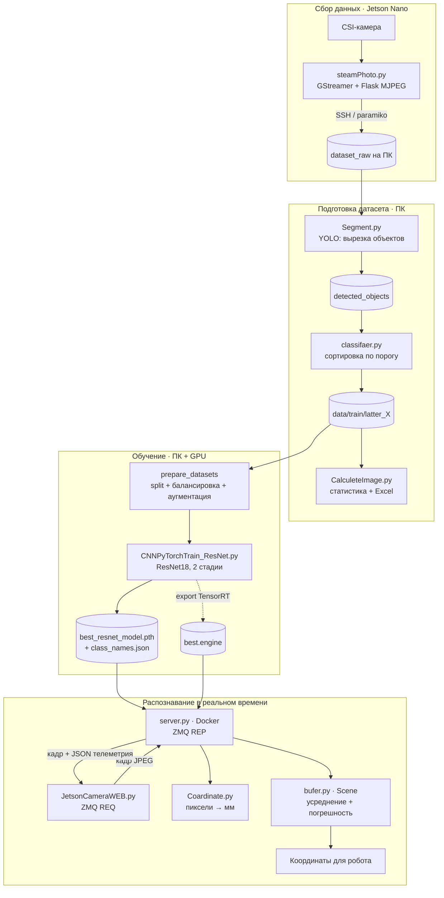
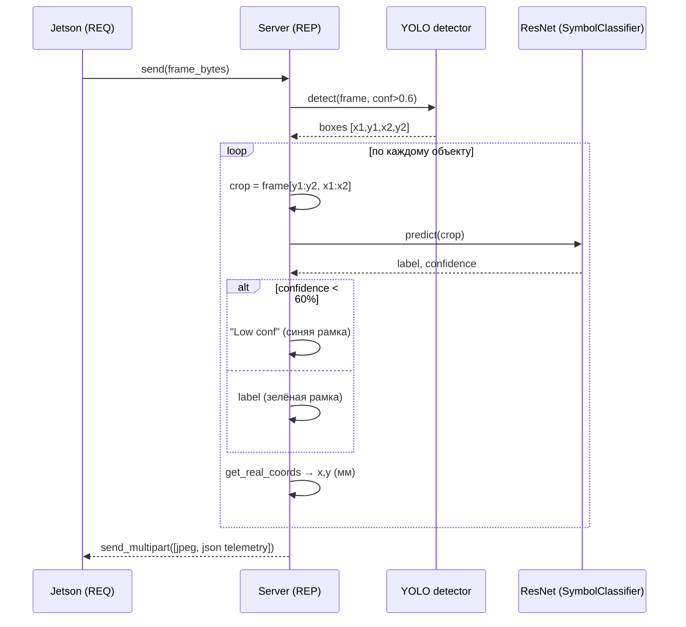
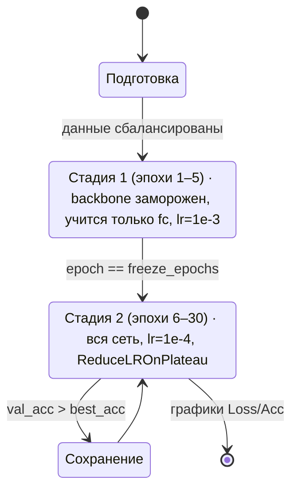

# Система компьютерного зрения и навигации

Распознавание русских букв на кубиках в реальном времени с определением их
положения (координаты в мм) и угла поворота. Рассчитана на работу с роботом и
платой **Jetson Nano Dev Kit** (CSI-камера IMX219).

Конвейер: **фото → детекция объектов (YOLO) → классификация буквы (ResNet18)
→ перевод в реальные координаты + угол → телеметрия для робота.**

---

## Возможности

- Сбор датасета с камеры Jetson и отправка на ПК по SSH.
- Полуавтоматическая разметка (сортировка кропов по уверенности модели).
- Обучение классификатора **ResNet18** в две стадии (заморозка backbone → fine-tuning).
- Два режима инференса:
  - **yolo_resnet** — двухэтапный: YOLO детектит → ResNet классифицирует;
  - **yolo_only** — сквозной: одна YOLO детектит и классифицирует.
- Перевод пиксельных координат в миллиметры (по геометрии камеры) и расчёт угла поворота.
- Усреднение измерений объекта между кадрами + оценка погрешности (std).

---

## Структура проекта

| Папка / файл | Назначение |
|---|---|
| `steamPhoto.py` | Захват кадров с CSI-камеры (GStreamer), MJPEG-стрим (Flask), отправка снимков на ПК по SSH |
| `CNNModelTrain/` | Подготовка датасета и обучение классификатора (актуальная версия) |
| `CNN/` | Более ранняя версия скриптов обучения/сегментации/классификации |
| `main/` | Live-распознавание с веб-камеры на ПК (`YoloResNetVision4.py` — актуальная) |
| `JetsonNano/JetsonYolo3/` | Клиент-серверный инференс на устройстве (актуальная версия) |
| `Models/` | Веса моделей (`.pt`, `.pth`, `.engine`) — **не в git** |
| `YoloModelTrain/` | Датасет и запуски обучения YOLO |

> Модули `TextDetection2.py`, `Coardinate.py`, `bufer.py` намеренно скопированы в
> каждую папку развёртывания, чтобы каждый узел (ПК / Jetson) запускался автономно.

### Ключевые модули

- **`TextDetection2.py`** — класс `SymbolClassifier` (ResNet18): кроп → буква + уверенность.
- **`Coardinate.py`** — `get_real_coords()` (пиксели → мм через GSD камеры), `get_angel()` (угол грани кубика 0–90° по HSV-маске + `minAreaRect`) и `get_letter_angle()` (полный угол буквы 0–360° по её максимальному контуру).
- **`angle_debug.py`** — отладочный скрипт: подбор HSV-диапазона оранжевого и проверка углов на фото.
- **`bufer.py`** — `Scene` / `Letter`: накопление измерений по объекту между кадрами, усреднение, std.
- **`Segment.py`** — нарезка объектов с фото моделью YOLO в кропы.
- **`classifaer.py`** — раскладка кропов по классам; неуверенные → `low_confidence`.
- **`CalculeteImage.py`** — статистика баланса классов + выгрузка в Excel.

---

## Архитектура (поток данных)



## Двухэтапный режим распознавания (yolo_resnet)



## Стадии обучения ResNet18



---

## Установка

```bash
python -m venv venv
venv\Scripts\activate        # Windows
pip install -r requirements.txt
```

На Jetson Nano `torch`/`torchvision`/`ultralytics` ставятся через JetPack или
docker-образ NVIDIA — см. `JetsonNano/Stup.txt`.

## Запуск

**Обучение классификатора (ПК):**
```bash
python CNNModelTrain/CNNPyTorchTrain_ResNet.py
```

**Статистика датасета:**
```bash
python CNNModelTrain/CalculeteImage.py
```

**Live-распознавание с веб-камеры (ПК):**
```bash
python main/YoloResNetVision4.py
```

**Инференс на Jetson Nano (в Docker):**
```bash
python3 JetsonYolo3/server.py --mode yolo_resnet   # или yolo_only
python3 JetsonYolo3/JetsonCameraWEB.py
```

---

## Параметры камеры (Jetson, IMX219)

Заданы в `Coardinate.py` / `config.py`:
- разрешение потока `1280×720`, фокус `f = 3.04 мм`;
- высота камеры над поверхностью `CAMERA_HEIGHT_MM` (в `config.py`);
- `CALIBRATION_FACTOR` — поправочный коэффициент по результатам калибровки.
