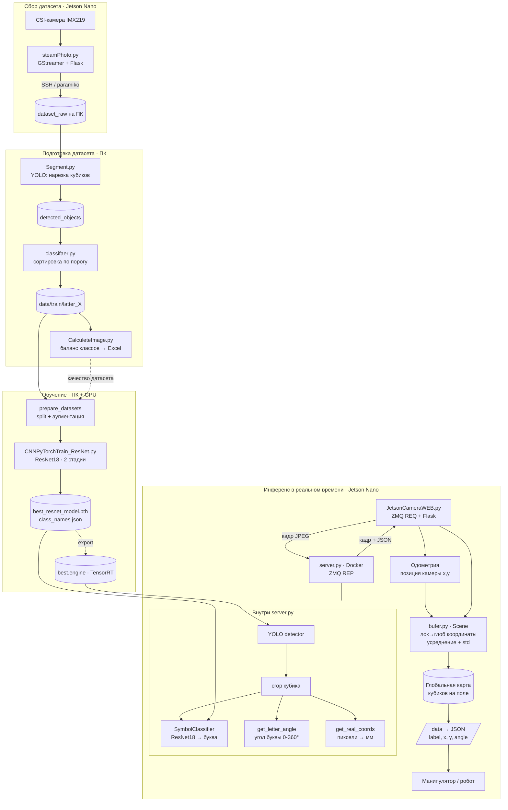
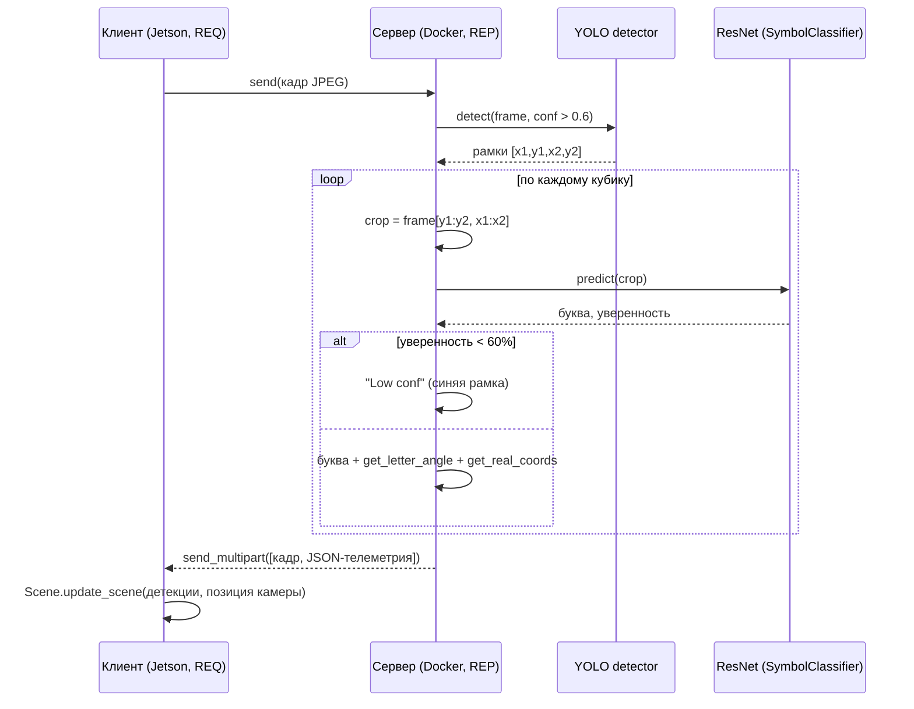
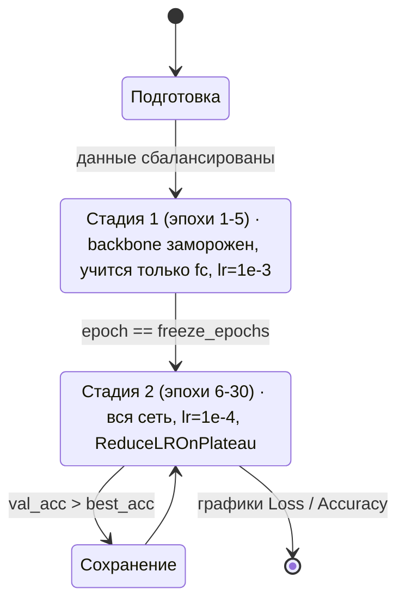
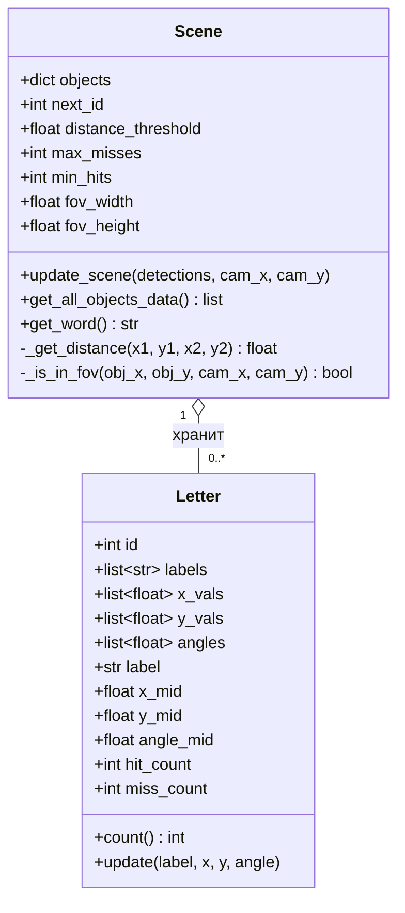
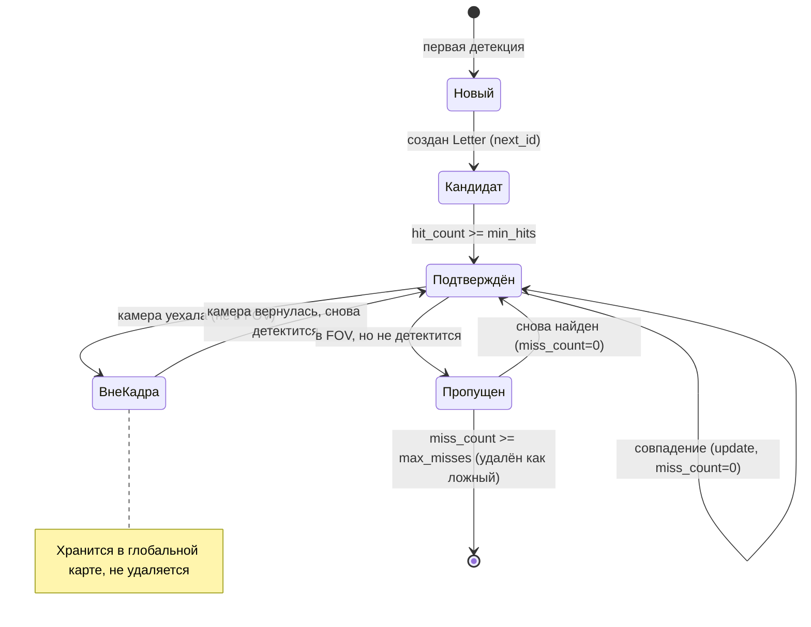
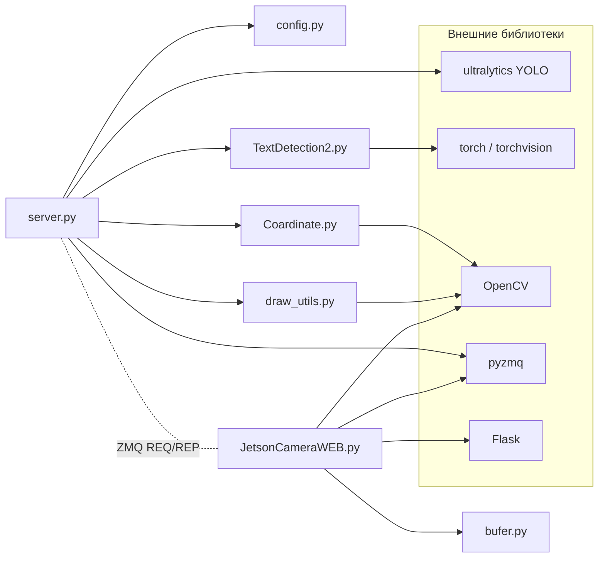
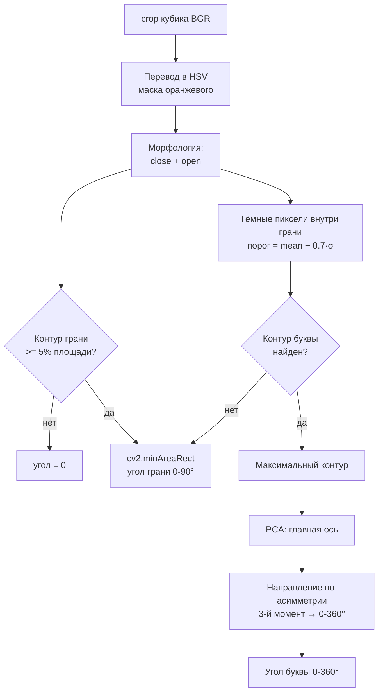
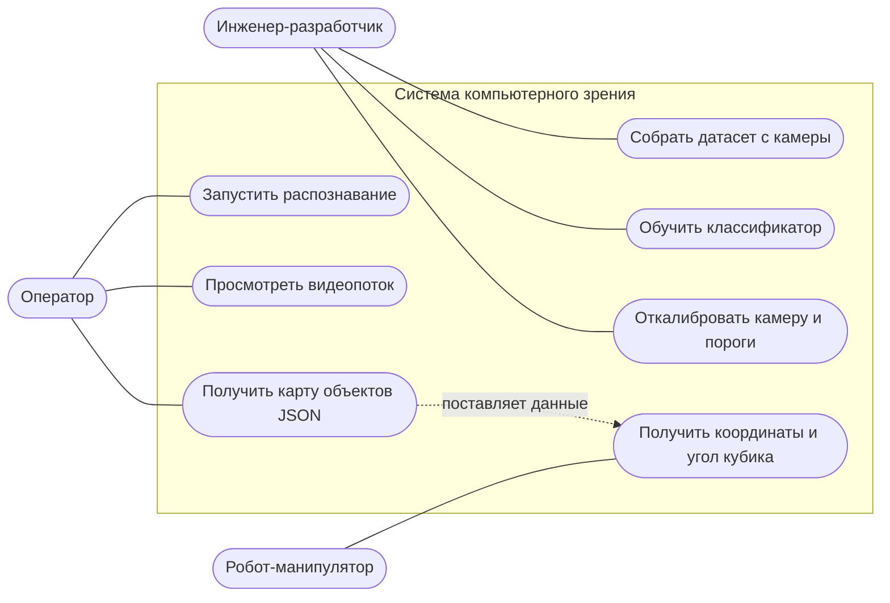
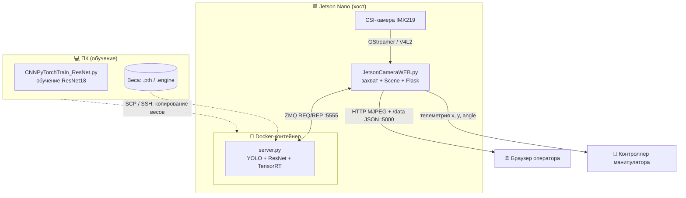
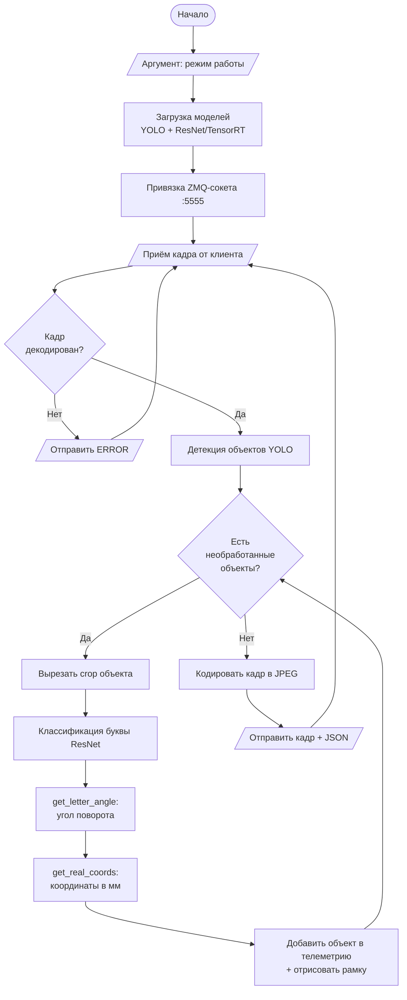

# Диаграммы системы компьютерного зрения и навигации

Графические материалы к пояснительной записке. Все схемы выполнены на языке
разметки **Mermaid** и отображаются на GitHub, в VS Code (расширение *Markdown
Preview Mermaid*) и в редакторе <https://mermaid.live> (для экспорта в PNG/SVG).

---

## Рисунок 1 — Общая архитектура системы (сквозной поток данных)

Полный жизненный цикл: сбор датасета → подготовка и разметка → обучение
классификатора → инференс в реальном времени с построением карты поля.

---

## Рисунок 2 — Двухэтапный режим распознавания (yolo_resnet)

Последовательность обработки одного кадра: детекция объектов нейросетью YOLO,
покадровая классификация каждого кубика сетью ResNet18, фильтрация по
уверенности и формирование телеметрии.

---

## Рисунок 3 — Стадии обучения классификатора ResNet18

Стратегия transfer learning: на первом этапе обучается только классификатор
(голова сети) при замороженном backbone, на втором — дообучается вся сеть с
пониженным шагом обучения и адаптивным планировщиком.

---

## Рисунок 4 — Диаграмма классов буфера сцены (bufer.py)

Структура накопления и усреднения измерений. Класс `Scene` хранит карту
обнаруженных объектов, выполняет ассоциацию новых детекций с уже известными
объектами и управляет их жизненным циклом. Класс `Letter` накапливает историю
измерений одного кубика и хранит усреднённые значения с оценкой погрешности.

---

## Рисунок 5 — Жизненный цикл объекта в буфере сцены

Логика устойчивого отслеживания кубика на карте при перемещении камеры.
Объект подтверждается после нескольких совпадений, сохраняется при выходе из
поля зрения камеры и удаляется только как ложный — если должен быть в кадре,
но не детектируется заданное число раз подряд.

---

## Рисунок 6 — Зависимости модулей узла инференса (JetsonYolo3)

Граф импортов программных модулей серверной и клиентской частей. Внешние
библиотеки выделены отдельно. Демонстрирует разделение ответственности:
детекция и классификация — на сервере, накопление карты — на клиенте.

---

## Рисунок 7 — Определение угла поворота кубика и буквы (Coardinate.py)

Алгоритм вычисления ориентации. Угол грани кубика определяется по силуэту
оранжевой грани (устойчиво, по модулю 90°), полный угол буквы — по её
максимальному контуру методом главных компонент.

---

## Рисунок 8 — Диаграмма вариантов использования (use-case)

Функции системы с точки зрения действующих лиц: оператора, обслуживающего
работу установки, инженера-разработчика, готовящего модель, и робота-
манипулятора как потребителя телеметрии.

---

## Рисунок 9 — Диаграмма развёртывания

Физическое размещение компонентов по узлам и протоколы взаимодействия между
ними. Тяжёлый инференс изолирован в Docker-контейнере с поддержкой TensorRT,
захват кадров и накопление карты выполняются на хост-системе Jetson Nano.

---

## Рисунок 10 — Блок-схема алгоритма главного цикла сервера (ГОСТ 19.701-90)

Алгоритм обработки видеопотока серверной частью: инициализация моделей,
приём кадра, детекция, покадровая классификация и измерение каждого объекта,
формирование и отправка телеметрии.

